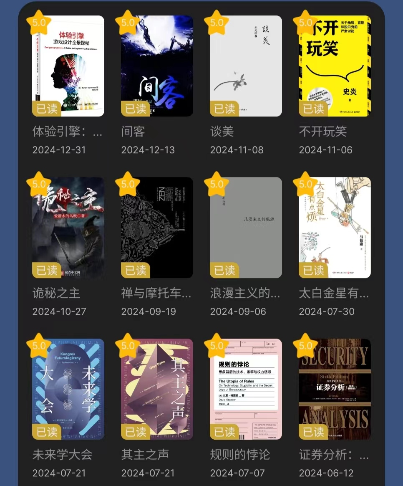
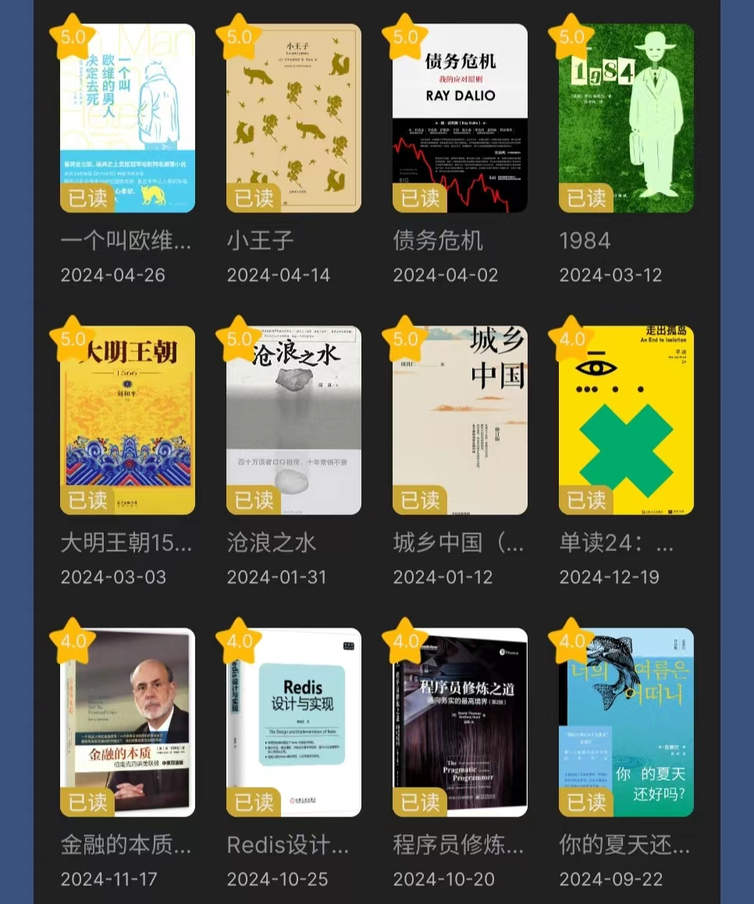
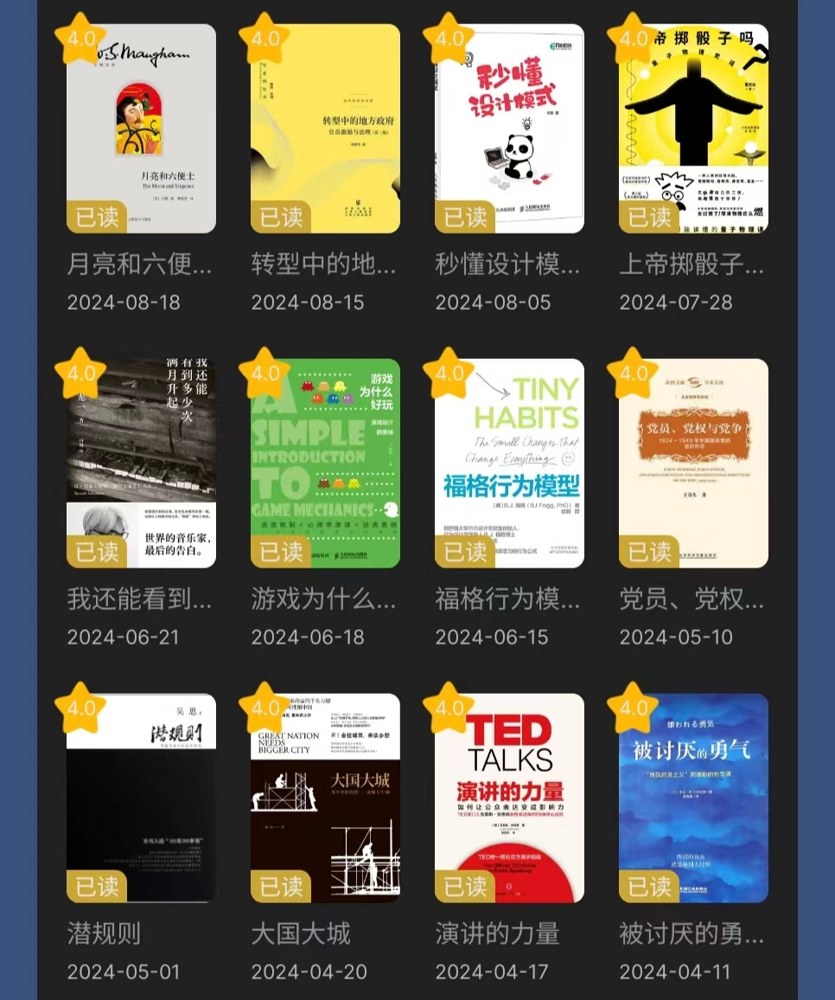
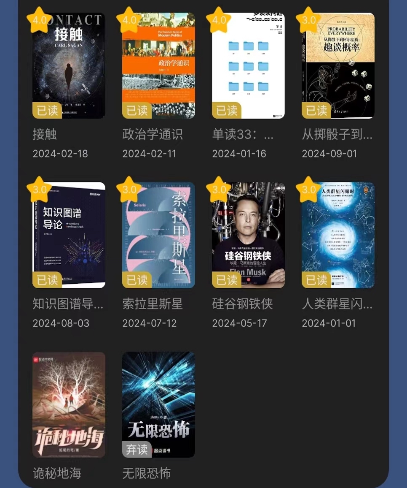
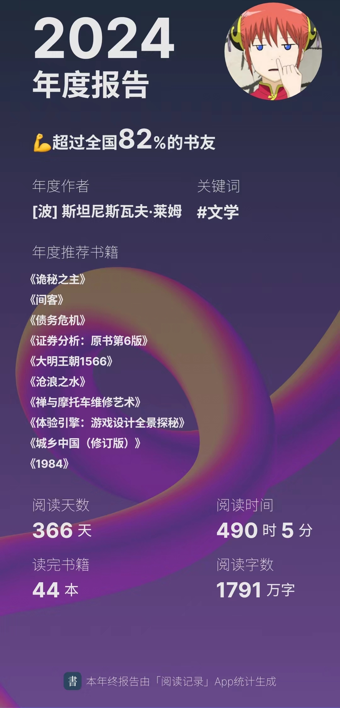
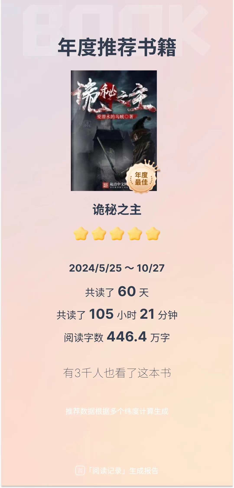

> Don't let anyone rush you with their timelines —— Jay Shetty

虽说开卷有益，但是在当下这个快节奏的社会里，沉下心来读书俨然成为了一件 ROI 极低的事情。时间花了大把，只学会很多互相冲突的道理，还无益于本职工作和人情往来，于是理所应当地“依然过不好这一生”。我们为什么要读书？我的答案是但求心安，做慢而正确的事情。

<!--more-->

2024这一年，微信读书成为了最常点击的 app 之一，阅读了近500小时，读完44本书，弃坑2本，年度数据和个人书单如下：

在一众5分书籍之中，强推以下这几本：







